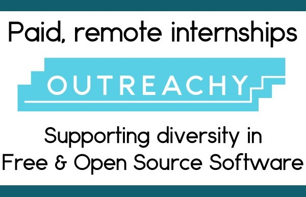
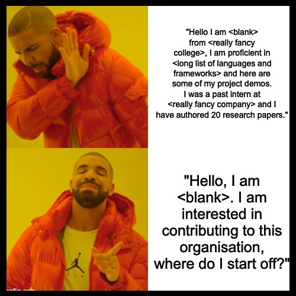

Title: Open Sourcery with Outreachy
Date: 05-06-2023
Tags: open-source, beginner, python, outreachy
Category: Guide
Slug: how-i-started-with-open-source
Author: Ananya Srivastava

Just three months ago, I was a complete novice in the realm of open source development, finding myself in the very position where countless aspiring individuals contemplate applying to prestigious programs like [Outreachy](https://www.outreachy.org) and [GSoC (Google Summer of Code)](https://summerofcode.withgoogle.com) annually. Let's be honest- I felt an overwhelming sense of intimidation. Having exhausted numerous resources in my quest to find excitement and enjoyment in web development, I had convinced myself that open source development might not be my calling. 

This might come as a surprise to you dear reader, but like you, I had looked at several Outreachy and GSoC mentee profiles on LinkedIn and they generally seemed to be proficient in a never-ending list of languages and frameworks.

<!---you vs the guy meme for github contri---->

> Fun fact: The inspiration behind the title of this blog (*disclaimer for a moment of sincere appreciation*) comes from the sheer joy and excitement I felt after creating my first pull request... and every PR since. There is such an electric sense of camraderie and belongingness within open source communities, it can almost feel *magical*.

Finally, in the spring of 2023 I got the happy news that I would be an Outreachy intern at __[scikit-image](https://scikit-image.org/)__ for the coming summer. 

*"Okay, that's great for you, but I am still intimidated by the application process. What is the actual journey for getting selected for such a program?"* Well that's what I am here for. I am going to lay it all out for you, step-by-step.

<!--insert michael scott surprised face gif---->

 First things first:

# What is Outreachy?

According to their website, *"Outreachy provides internships in open source and open science. Outreachy provides internships to people subject to systemic bias and impacted by underrepresentation in the technical industry where they are living."* Outreachy internships are remote and they last for 3 months (or 13 weeks). *"Outreachy internship projects may include programming, research, user experience, documentation, graphical design, data science, marketing, user advocacy, event planning, and more!"* Whatever your domain may be, there is probably a project that requires your specific skills.

<!--insert Outreachy logo----> 

# Comprehensive Guide for an Outreachy Applicant

Outreachy Applications open twice a year. If you are a student living in the Northern Hemisphere, they open during January. Make sure to check the [eligibility criteria](https://www.outreachy.org/apply/eligibility/).

## The Initial Application

After registering on their portal and confirming that you're eligible, you will be prompted to answer 4 important essay questions. The deadline for the essay round is usually a month after the applications have opened, but I encourage you to submit your answers within a week or two after they have opened. This is because many applicants are not aware that Outreachy organisers review applications __*on a rolling basis*__, that is, this is a qualifying round to select candidates on a first-come-first-serve basis.

The four essay questions are:

  1. Are you part of an underrepresented group (in the technology industry of the country listed above)? How are you underrepresented?

  2. What systemic bias or discrimination would you face if you applied for a job in the technology industry of your country?

  3. Does your learning environment have few people who share your identity or background?

  4. What systemic bias or discrimination have you faced while building your skills?

There is also a section to add content warnings for the essay reviewer if you are mentioning sensitive issues.

The research that I did to answer these questions was related to statistical figures and studies/surveys conducted about systemic biases. *Try to back your claims with as many facts and figures as possible (link your sources wherever possible).* Also, always stick to the word limit.

I am a woman about to break into the Indian tech sector. My essay answers and anecdotes aligned with *my* individual experience. If you (fortunately) don't have any first-hand accounts to share, try reaching out to similarly marginalised people (seniors, mentors or relatives) who have achieved the career goals that you aspire towards. For example, I had a discussion with my aunt who has been in the industry for a long time. She had a lot of insights about navigating her way through discrimination at the hands of bigoted colleagues while fighting sexist corporate policies. 

__*Remember to get your essays proof read by a mentor/senior before submitting them.*__
Going through Outreachy's [applicant guide](https://www.outreachy.org/docs/applicant/) was really helpful for me.

## The Contribution Period
 
Congratulations, your initial application was approved! __*Now pick an organisation, choose a project, introduce yourself to the community, get a feel of the project, and start contributing!*__
> *Breathe.*

The period between your initial application deadline and the beginning of the contribution period is imperative to your selection because this is when you pick an organisation that aligns with your skills, while also skilling up little-by-little.

My tips for choosing projects:

  * __Your interest matters.__ Choose a project that seems exciting *to you*, this could be anything from technical documentation to data science.
  
  * __Your skill level may/may not matter.__ Usually, Outreachy projects don't require you to be *proficient*, so you can choose a project without hesitation. But some organisations *are* looking to hire experienced interns, so check the *"Required skill level"* for your project.

  * __Be organised.__ If you are applying with a close friend, I would recommend you to create a collaborative document of organisations that you are interested in. There are a huge number of communities hiring from Outreachy every year, so it can be harder for a single person to survey *every one of them*. I would recommend creating an organised sheet even if you are working alone because it can be easier to cross things off a list.

  * __Join the community chats/servers/mailing lists of communities you are interested in.__ The best way to get a feel of the community and the work that they do is by observing their day-to-day interactions. *Disclaimer: A lot of people get stuck in the loop of joining a large number of communities, introducing themselves, and never interacting again.* Although, I would encourage giving a brief introduction of yourself if you want to, please refrain from *blurting out your entire resume/CV*. I will tell you what one of my project mentors at scikit-image once reminded me: 
  > *Actions speak louder than words.*

  <!---drake meme for intro--->
  
  

  * __Adhere to communication guidelines.__ Remember to use inclusive language and be respectful.

  * __Quality Projects >> Quantity of Projects__ is a great rule of thumb to follow. I would recommend boiling down to 2-3 organisations/projects *at most*. Choose an organisation that is really competitive to get into, and one or two that have comparatively less traffic.

I ended up selecting scikit-image as the one organisation that I would spend the most time contributing to. I have been interested in the domain of image processing for quite some time (some self promo: [__my research paper__](https://ieeexplore.ieee.org/abstract/document/10064887)).

After the results are out, the __*contribution period*__ begins. The rest of this section deals with programming related projects only.

## Your first PR
  
You can either start off by exploring the software that your organisation produces, or get a feel of things as you go. Begin by setting up the development environment, don't be intimidated if you are not comfortable with using the command line. Most open source packages have a __Contribution Guideline__ that will give you step-by-step instructions on how to set up your environment. But diverse operating systems and deprecating dependencies can be a nightmare to deal with. 
  
__*Advice: This is where most applicants stop trying. This is generally the most overwhelming part of your journey to becoming an open source contributor. Here is a reminder to not stop trying because one day you will emerge glorious.*__

Fear not, because providing help is what the community forums and chats are for. There is an exquisite Medium blog titled [__How to be great at asking coding questions__](https://medium.com/@gordon_zhu/how-to-be-great-at-asking-questions-e37be04d0603) that I recommend giving a read before you start asking questions.

After you are all set up, if your organisation's codebase exists on GitHub, I would recommend looking for GitHub Issues marked with tags like `good first issue`, `beginner` or `documentation` . Starting off with a documentation PR (pull request) is less overwhelming, while it also familiarises you with the *Contribution and Testing GitHub Workflow* of the software. As you can see from [__my first PR__](https://github.com/scikit-image/scikit-image/pull/6779), it was the smallest contribution that I could make as a beginner, and I got to interact with people who were way more experienced than I was.

__*Reiteration is key.*__ Being a Type-A personality with a penchant for perfectionism, it was hard for me to make work-in-progress contributions. But, as you will observe by your fifth or sixth PR, the two Rs of software development are __Review__ and __Reiterate__. I encourage you to ask for feedback and improve the quality of your PRs progressively. Here is another resource for writing [__great commit messages__](https://cbea.ms/git-commit/#imperative).

Kudos on making your first contribution! It is indeed very thrilling. You are officially an *open source contributor* now!

The principle of __Quality >> Quantity__ applies here as well, keep making quality contributions to your project. Remember to adhere to critical feedback, but don't haggle your project mentors because Outreachy mentors usually have other time commitments as well. 

*A bit of advice here, if you are a week into the contribution period and you observe that the mentors and the community are not interactive at all, or if the Issues/PRs are very old (which is rare), try focusing on another organisation instead. It can be quite disheartening to put effort into a community that isn't active at all.*

## The Final Application

This is the easiest step of the journey, but also the *most crucial*. The final application requires you to record all the contributions that you made to the project that you are applying for. This helps the Outreachy organisers as well as the project mentors evaluate your performance. I would hesitate in suggesting a decent *number* of contributions but they should be a mix bag of relatively easier as well as time-taking contributions which highlight your specific skills that the project requires.

Optionally, you can also submit a proposed timeline for your project. I recommend discussing this with your mentor and creating a timeline because it shows your avid interest in working with the organisation.

There are also 2-3 essay questions that you are prompted to answer. Firstly, they ask you to highlight any previous work that you have done which can showcase your skills for the project. The other two questions ask you to mention your past and current experience being a part of the open source community that you are applying to. You can be as candid as you want to be while writing these essays.

The final applications are __not__ reviewed on a first-come-first-serve basis, but I encourage you to submit it at least a day prior to the deadline. You can always edit the application before the deadline if you want to.

There is nothing to do but wait for the results now (*and try not losing your mind while you are at it*).

# Results Day

Congratulations if you made it! I am really proud of you. If you tried your best and still didn't make it, I am proud of you. The *sorcery* (or magic, if you will) of open source lies in its sheer vastness and depth. If you loved contributing, I encourage that you don't stop contributing. There is an endless sea of open source programs that you can apply to. 
> Foster your curiousity and the spirit to learn!

## Final Remarks

The past couple of months have been a whirlwind of a journey for me. I am incredibly grateful for this opportunity. I have always wanted to start a tech blog, but I never thought that I had enough to offer. Through Outreachy, I am recognising the importance of voicing your opinion, that everyone can offer their own tiny bit to make the world a better place.
Currently, I am navigating remote work because my Outreachy internship started a week ago. There is still loads for me to learn, and I hope to take you with me through my journey of exploration and *__Open Sourcery__*!

